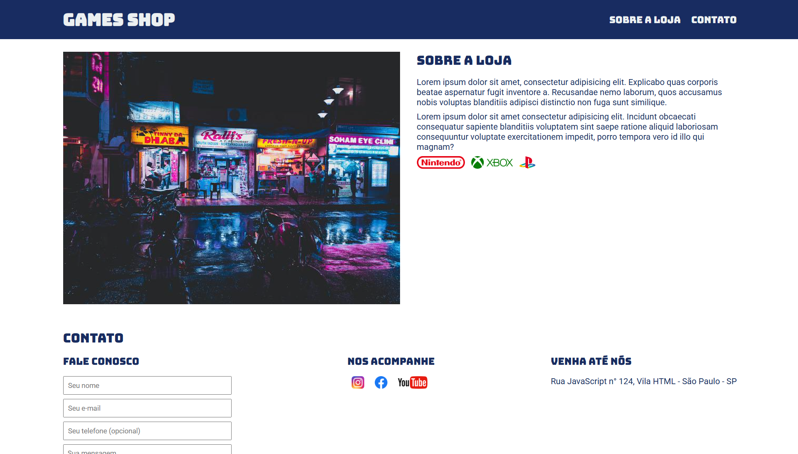

# 🎮 Games Shop

Bem-vindo ao **Games Shop**, um site de e-commerce fictício para venda de jogos e consoles. Este projeto é uma demonstração de estruturação de uma página web simples, utilizando HTML e CSS.

## 📌 Sobre o Projeto

O **Games Shop** é um site estático que apresenta uma loja de games com informações sobre a empresa e um formulário de contato. O site é responsivo e utiliza **Google Fonts** para estilização.

## 📸 Captura de Tela



## 🚀 Tecnologias Utilizadas

O projeto foi desenvolvido com as seguintes tecnologias:

- HTML5
- CSS3
- Google Fonts (Bungee, Roboto)

## 🎯 Funcionalidades

- 📖 **Seção "Sobre a Loja"**: Informações básicas sobre a empresa.
- 📩 **Formulário de Contato**: Permite que clientes enviem mensagens.
- 🔗 **Links para Redes Sociais**: Ícones com links fictícios para Instagram, Facebook e YouTube.
- 🏠 **Endereço Fictício**: Simulação de um local físico para a loja.

## 📦 Como Executar o Projeto

1. Clone este repositório:
   ```bash
   git clone https://github.com/ellencigoli/games-shop.git
   ```
2. Acesse a pasta do projeto:
    ```bash
    cd games-shop
    ```
3. Abra o arquivo `index.html` no navegador.

## 📝 Melhorias Futuras

- 🔧 Implementação de um sistema de login para usuários.
- 🛒 Adição de um carrinho de compras dinâmico.
- 🔥 Integração com um backend para gerenciar produtos.

## 💡 Contribuição

Fique à vontade para sugerir melhorias ou abrir pull requests! 😊

## 👩‍💻 Desenvolvedor

- [Ellen Cigoli](https://github.com/ellencigoli/)

Caso tenha dúvidas ou sugestões, entre em contato! 💬

---

## 📄 Licença

Este projeto está licenciado sob a licença **MIT**. Consulte o arquivo [LICENSE](LICENSE) para mais detalhes.
